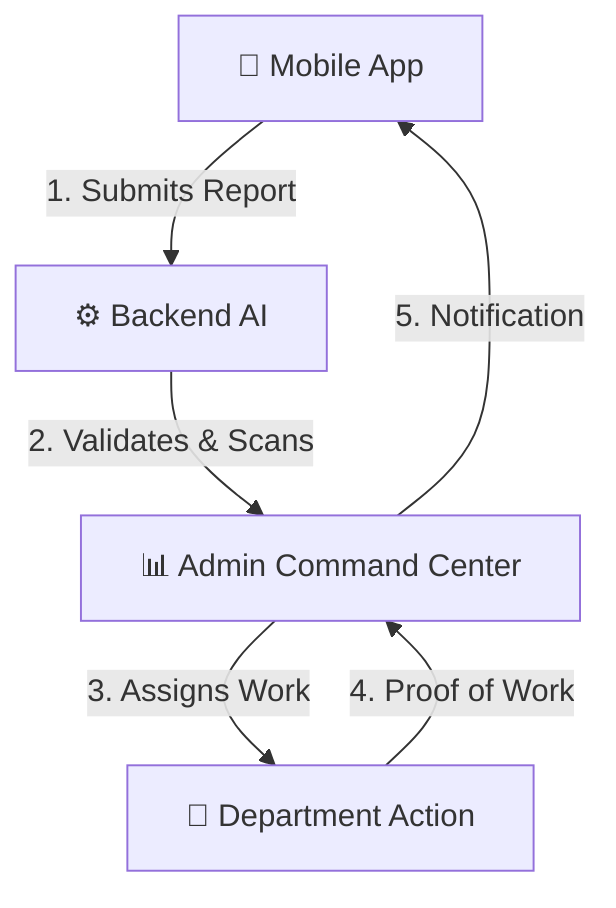
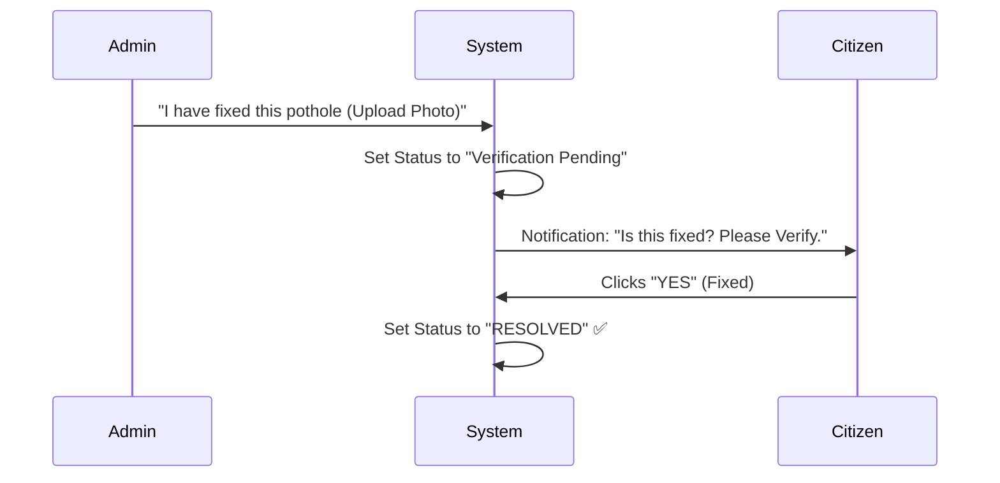

# 🧩 SCMS: The Logic & Architecture Guide
### *A Non-Technical Person's Guide to how the System "Thinks"*

This document explains the "Brain" of the Smart Complaint Management System (SCMS) using simple logic flows. It is designed for project evaluators and non-coding stakeholders.

---

## 🏗️ 1. The Big Picture (System Core)
The system is built as a "Triple-Layer" architecture. Each layer has a specific job:

1.  **Mobile App**: The "Eyes" of the system. It captures photos and GPS data.
2.  **Backend AI**: The "Brain". it decides if a complaint is real, urgent, or a duplicate.
3.  **Admin Command Center**: The "Command". Humans monitor the AI's suggestions and manage resources.

---

## 🤖 2. The "Sentinel AI" Logic
When a citizen clicks "Submit," the system doesn't just save the data. it runs through a **Logic Filter** to prevent garbage data.

### 🛡️ A. Duplication Check (The Anti-Noise Filter)
*   **Logic**: "Is there already a pothole reported here?"
*   **How it works**:
    1.  The system looks at the GPS coordinates.
    2.  If another complaint is within **50 meters**, it stops.
    3.  It then compares the **Text Description**.
    4.  If they are similar, it tells the user: *"Someone already reported this! Just upvote their report to save time."*

### 😊 B. Sentiment Analysis (The Emotional Filter)
*   **Logic**: "How stressed is the citizen?"
*   **How it works**:
    1.  The AI reads the description.
    2.  It uses a **Neural Network** (DistilBERT) to detect if the tone is "Negative" or "Angry."
    3.  If the citizen is highly distressed, the **Priority** is automatically boosted to "High."

---

## 🛡️ 3. The "Trust System" Logic (Citizen Verification)
This is a unique feature that ensures transparency and prevents "Fake Closures" by officials.

*   **Logic**: "Don't take the official's word for it; ask the people on the street."
*   **Result**: The issue only turns **Green** when the community agrees it is fixed.

---

## 🔋 4. Reliability Logic (Offline-First)
*   **Problem**: What if there is no internet in a rural area?
*   **Logic**: "Save now, Sync later."
*   **Process**: 
    1.  User files a report in a "No-Signal" zone.
    2.  App saves it in a **Safe Vault** (Local DB).
    3.  A **Background Watchdog** waits for internet.
    4.  As soon as 4G returns, the report is "Sent" automatically without the user opening the app.

---

## 📂 5. Folder Structure Map
If you want to find where the "Logic" lives in the code:

*   **`ANDROID_APP/app/`**: Contains the **Mobile App** (The user interface and GPS logic).
*   **`WEB_AND_BACKEND/scms-backend/`**: Contains the **System Brain** (The AI models and Database logic).
*   **`WEB_AND_BACKEND/scms-admin/`**: Contains the **Command Center** (The maps and analytics dashboard).
*   **`WEB_AND_BACKEND/scms-backend/classifier.js`**: This is where the **AI decision-making** happens.

---
*Created for the SCMS 2026 Final Year Project Submission.*
