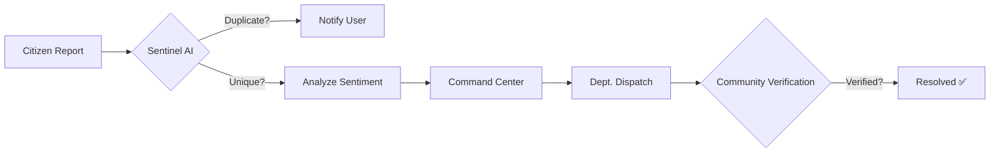

# 🛡️ SCMS: Smart Complaint Management System
### *AI Sentinel Edition — B.Tech CSE Final Year Project*

**SCMS** is an advanced, full-stack municipal governance platform designed to revolutionize how citizens interact with city administration. Unlike traditional complaint portals, SCMS integrates a **Simulated AI Intelligence Layer** (Sentinel AI) to manage infrastructure issues with high precision, zero duplication, and autonomous prioritization.

---

## 🧩 Project Logic & Transparency
If you are a non-technical evaluator, please refer to our **[PROJECT_LOGIC_GUIDE.md](PROJECT_LOGIC_GUIDE.md)** for a plain-English explanation of how the system works.

### Core Logic Flow:


---

## 🚀 The "Sentinel" System Workflow: How it Works

The SCMS ecosystem operates through a closed-loop intelligence cycle between the **Citizen**, the **AI Engine**, and the **City Administrator**.

### 1. Unified Citizen Onboarding
- **Secure Authentication:** Citizens log in via a dual-mode system (Email/Password or Firebase Phone OTP).
- **Profile Registry:** Each citizen has a profile that tracks their "SCMS Points" (Social Credits), encouraging honest and helpful reporting.

### 2. Intelligent Incident Reporting
- **Multi-Evidence Capture:** Citizens can take up to 5 high-resolution photos of an issue (potholes, water leaks, etc.).
- **Live Geospatial Tracking:** The app automatically detects the **District**, **Address**, and precise **GPS Coordinates** using a hybrid of Google Fused Location and Backend Nominatim API.
- **Sentinel AI Pre-Scan:** As the user captures photos, the "AI Sentinel" performs a visual scan (simulated fingerprinting) to ensure the image is a valid infrastructure issue.

### 3. The "Gatekeeper" (Duplication Detection)
Before a complaint is submitted, the **AI Engine** performs a real-time audit:
- **Spatial Audit:** Checks if a similar complaint exists within a 50-meter radius.
- **Semantic Audit:** Analyzes the description text using NLP to see if the same issue was reported by another user.
- **Decision:** If a match is found, the user is alerted via a **Sentinel Vision Dialog** and encouraged to "Upvote" the existing report instead of creating database noise.

### 4. Admin Command Center & AI Intake
Once a unique complaint is filed, it hits the Admin Dashboard, where the AI takes over:
- **Autonomous Priority Scoring:** The AI scans for emergency keywords and sets a priority score from 0-100.
- **Sentiment Pulse:** The system detects if a citizen is angry or panicked, flagging the report for immediate attention.
- **Department Dispatch:** The AI recommends the best unit for the job (e.g., "Electricity Board" for live wires).

### 5. Resolution & Verification
- **Dispatching Units:** The Admin assigns the task to a specific department.
- **Closure with Proof:** Once the work is done, the Admin uploads a **Resolution Photo** as proof.
- **Citizen Feedback Loop:** The citizen receives a high-priority push notification confirming their issue has been solved.

---

## ⚡ Technical Architecture & Optimizations

### 🔋 Offline-First Resilience
The app is designed for real-world reliability. If the user is in a "Dead Zone" (no internet):
- Data is saved in a local **Room Database**.
- **WorkManager** schedules a background task that "wakes up" as soon as a 4G/Wi-Fi connection is detected to sync the report.

### 📶 Data & Battery Optimization
- **10MB Intelligent Cache:** Uses OkHttp caching to serve repeated data (like Leaderboards) without using the internet.
- **Image Compression:** Raw 5MB photos are compressed to <500KB before upload, saving 90% of user data.
- **Battery Guard:** Background sync only runs if the battery is not low and the connection is stable.

### 🔔 High-Priority Emergency Signal
Uses **Firebase Cloud Messaging (FCM)** with `PRIORITY_HIGH` flags to ensure that critical city alerts (like floods or road closures) pop up on the citizen's **Locked Screen** immediately, just like a WhatsApp message.

---

## 🛠️ Technology Stack

| Layer | Technology |
|---|---|
| **Mobile Application** | Kotlin, Jetpack Compose, Retrofit2, Room DB, WorkManager, Coroutines |
| **Admin Dashboard** | React.js, Vite, Leaflet.js (Maps), Chart.js (Analytics), Tailwind CSS |
| **Backend Server** | Node.js, Express.js, HuggingFace NLP API (Semantic Similarity) |
| **Database** | MySQL (Structured Storage) + Firestore (Real-time Broadcasts) |
| **Media Management** | Cloudinary API (Automated Image Optimization & CDN) |

---

## ⚡ Quick Setup Guide

### 1. Backend Setup
```bash
cd WEB_AND_BACKEND/scms-backend
npm install
# Add your .env (CLOUDINARY_URL, FIREBASE_CONFIG)
npm start
```

### 2. Admin Setup
```bash
cd WEB_AND_BACKEND/scms-admin
npm install
npm run dev
```

### 3. Mobile App Setup
- Open **ANDROID_APP** folder in Android Studio.
- Change `BASE_URL` in `data/network/RetrofitClient.kt` to your machine's IP address.
- Connect your phone and press **Run**.

---

## 🎓 Academic Contribution
This project was developed for a **B.Tech Computer Science Final Year Project**. It demonstrates proficiency in:
- **Full-Stack System Design**
- **Mobile Computing & Declarative UI**
- **AI/ML Concepts in Urban Governance**
- **Distributed System Resilience**

---
*Developed by **Sushanta Chetry** — SCMS 2026 Release*
